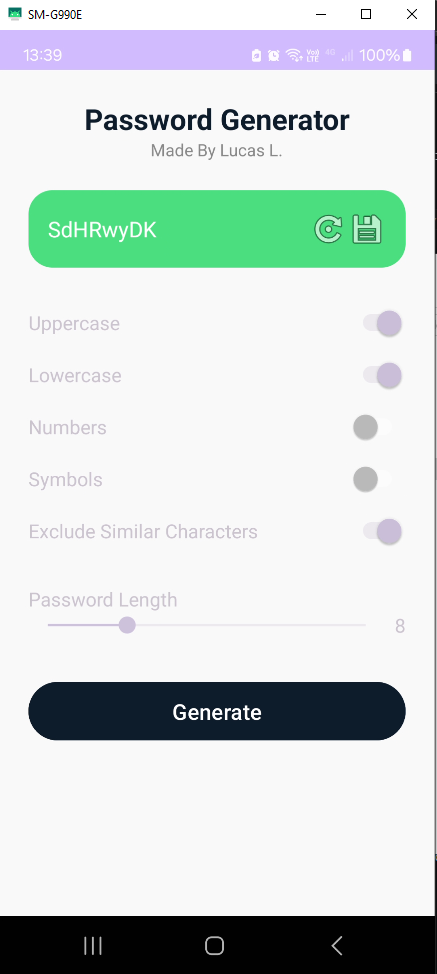
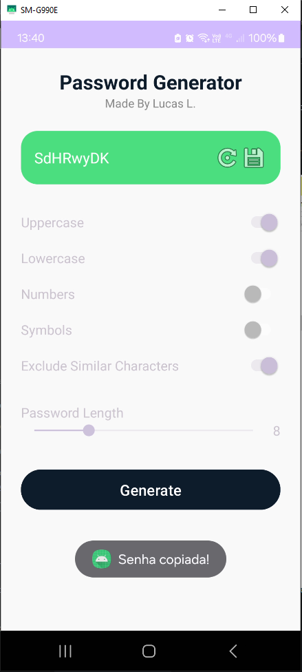

# 🔐 Gerador de Senhas - Android

Aplicativo desenvolvido como parte da **Atividade da disciplina de Desenvolvimento Mobile**, com o objetivo de criar uma interface e lógica funcional para um **gerador de senhas aleatórias** no Android Studio, utilizando Kotlin para a lógica e XML para o layout.

---

## 📱 Funcionalidades

- Ativação de **letras maiúsculas**, **minúsculas**, **números** e **símbolos**.
- Opção para **excluir caracteres semelhantes** (ex: i, l, 1, o, 0, O).
- Definição do **tamanho da senha** com SeekBar (1 a 32 caracteres).
- Botão para **gerar** e **regenerar** uma nova senha.
- Botão para **copiar a senha**, exibindo **toast de confirmação**.
- Prevenção de geração quando **nenhuma opção estiver marcada**.

---

## 🖼️ Capturas de Tela

### ⚠️ Nenhuma opção selecionada
Exibe mensagem impedindo a geração de senha:
> **"Selecione pelo menos uma opção"**

---

### 🔑 Senha Gerada com opções configuradas
Senha forte e aleatória gerada com base nas opções marcadas:

---

### 📋 Toast de confirmação
Após clicar no botão de cópia, aparece um Toast com a mensagem:
> **"Senha copiada!"**

---

## ⚙️ Tecnologias Utilizadas

- **Kotlin**
- **XML**
- **Android Studio**
- Componentes:
  - `TextView`
  - `Switch`
  - `SeekBar`
  - `Button`
  - `ImageButton`
  - `Toast`

---

> **IFTM - Instituto Federal do Triângulo Mineiro**  
> **Curso:** Análise e Desenvolvimento de Sistemas  
> **Disciplina:** Programação para Dispositivos Móveis  
> **Período:** 6º Semestre

